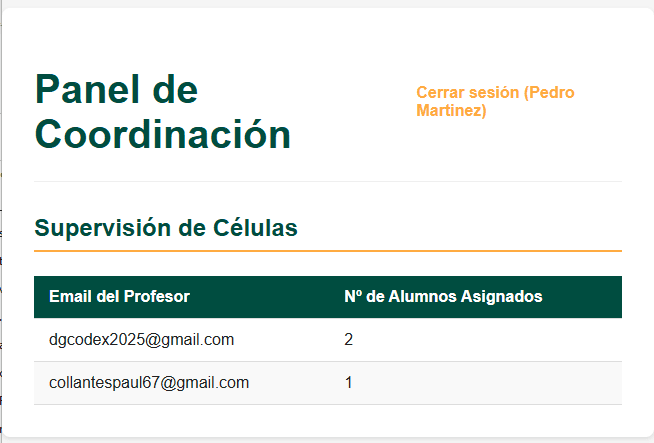
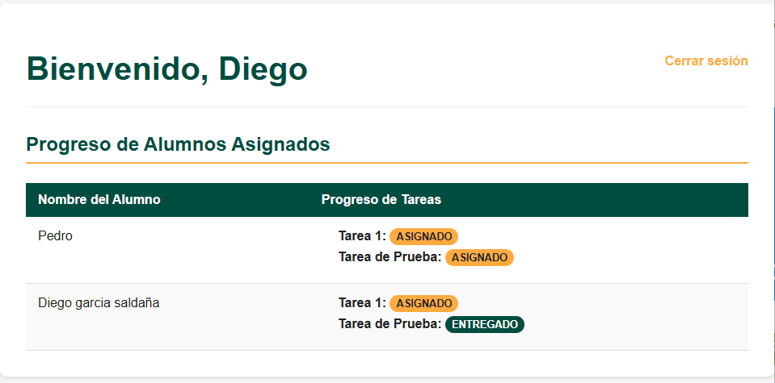
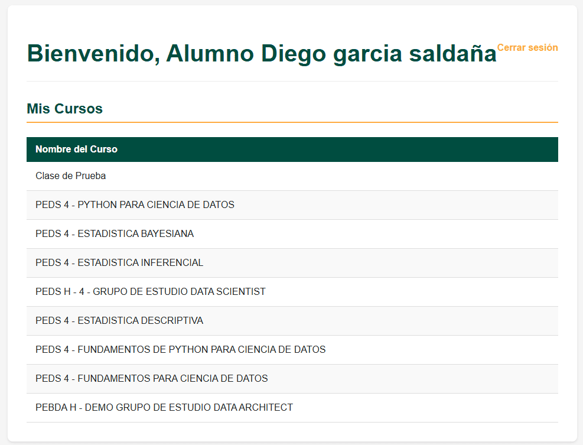

# 📊 Dashboard de Gestión para Semillero Digital

**Una capa de visualización y gestión construida sobre Google Classroom para potenciar el seguimiento de alumnos y la toma de decisiones.**

_Proyecto desarrollado por DIEGO GARCIA SALDAÑA para la Nerdearla Vibeathon 2025._

---

## 🎯 El Problema

**Semillero Digital** es una ONG que realiza un trabajo increíble formando a jóvenes en oficios digitales. Utilizan Google Classroom, pero enfrentan tres desafíos clave a medida que crecen:
1.  **Seguimiento del Progreso:** No tienen una vista consolidada del avance por alumno y profesor.
2.  **Métricas Difíciles de Obtener:** Extraer datos de participación y entregas es un proceso manual y lento para los coordinadores.
3.  **Falta de Segmentación:** No pueden visualizar a los alumnos según su "célula" o grupo de mentoría asignado a cada profesor.

## ✨ Nuestra Solución

Esta aplicación web es una **capa de inteligencia** que se conecta directamente a la API de Google Classroom para resolver estos problemas. El objetivo no es reemplazar Classroom, sino potenciarlo con las vistas y los datos que Semillero Digital necesita.

La plataforma implementa un **sistema de roles** con 3 dashboards distintos:

### 1. 📈 Vista del Coordinador
El coordinador tiene acceso a un panel de supervisión global. En lugar de revisar alumno por alumno, ve un resumen de alto nivel de todas las "células", mostrando a cada profesor y cuántos alumnos tiene a su cargo. Esto automatiza la recolección de métricas básicas.



### 2. 👨‍🏫 Vista del Profesor
Al iniciar sesión, un profesor ve un panel limpio que le muestra **únicamente a los alumnos de su célula**. Para cada alumno, puede ver el estado de sus entregas en tiempo real (Asignado, Entregado, Calificado), permitiendo un seguimiento cercano y eficiente con un sistema de colores intuitivo.



### 3. 🎓 Vista del Alumno
Los alumnos tienen un portal simple donde pueden ver los cursos en los que están inscritos, centralizando su experiencia de aprendizaje.




## 🛠️ Tecnologías Utilizadas
* **Backend:** Python con Flask & SQLAlchemy
* **Base de Datos:** PostgreSQL
* **Frontend:** HTML5, CSS3
* **Autenticación y API:** Google OAuth 2.0 y Google Classroom API
* **Entorno:** Python venv

---

## 🚀 Cómo Ejecutar el Proyecto

Para probar este proyecto en tu máquina local, sigue estos pasos:

**Pre-requisitos:**
* Tener instalado Python 3.10+
* Tener instalado Git
* Tener un servidor de PostgreSQL instalado y corriendo.

**Pasos:**
1.  **Clona el repositorio:**
    ```bash
    git clone [https://github.com/DIEGOJGS/nerdearla-vibeathon-2025.git](https://github.com/DIEGOJGS/nerdearla-vibeathon-2025.git)
    cd nerdearla-vibeathon-2025
    ```
2.  **Crea y activa un entorno virtual:**
    ```bash
    # En Windows
    python -m venv venv
    venv\Scripts\activate
    ```
3.  **Instala las dependencias:**
    ```bash
    pip install -r requirements.txt
    ```
4.  **Configura la Base de Datos:**
    * Abre PostgreSQL y crea una nueva base de datos llamada `hackaton` con codificación `UTF8`.
    * En el archivo `app.py`, actualiza la línea `SQLALCHEMY_DATABASE_URI` con tu usuario y contraseña de PostgreSQL.

5.  **Configura las Credenciales de Google:**
    * Sigue la guía de Google para crear un proyecto en la Google Cloud Console y habilitar la API de Google Classroom.
    * Crea credenciales de tipo "Aplicación Web", autoriza el URI de redirección `http://127.0.0.1:5000/callback` y descarga el archivo JSON.
    * Renombra el archivo a `client_secret.json` y colócalo en la raíz del proyecto (este archivo está ignorado por Git y no se subirá).
    * Añade los correos de prueba a la "Pantalla de consentimiento de OAuth".

6.  **Inicia la aplicación:**
    ```bash
    python app.py
    ```
7.  Abre tu navegador y ve a `http://127.0.0.1:5000`.

---
## 🔮 Visión a Futuro
* **Reportes Gráficos:** Implementar un dashboard para el coordinador con gráficos sobre el porcentaje de entregas y el rendimiento por célula.
* **Asistente con IA:** Integrar un chatbot para que los alumnos puedan resolver dudas frecuentes sobre sus cursos.